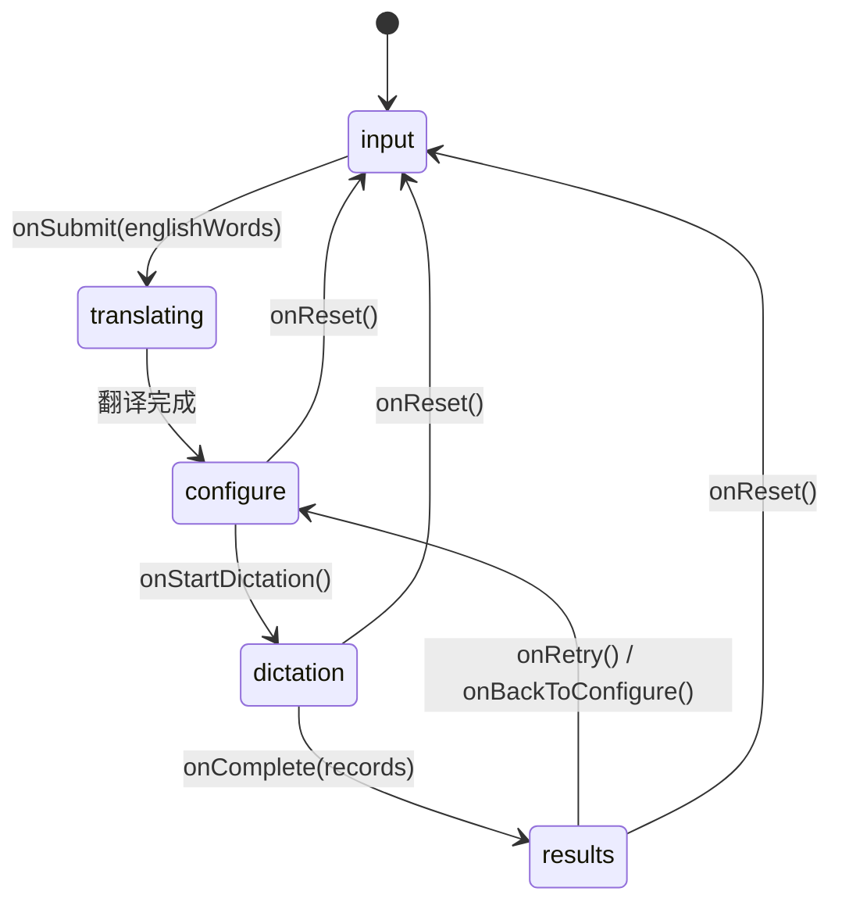

# 英语默写助手 — 架构文档

> **版本**: 1.0.0  
> **Flutter SDK**: ^3.12.2  
> **UI 框架**: Cupertino (iOS 风格)  
> **依赖**: `flutter_tts` (语音合成), `http` (翻译 API), `pdf` + `printing` (默写表 PDF 导出)

---

## 目录

1. [项目概述](#1-项目概述)
2. [目录结构](#2-目录结构)
3. [架构模式](#3-架构模式)
4. [数据模型层](#4-数据模型层)
5. [服务层](#5-服务层)
6. [页面层](#6-页面层)
7. [协调器 —— 状态机](#7-协调器--状态机)
8. [数据流图](#8-数据流图)
9. [组件树](#9-组件树)
10. [默写双模式设计](#10-默写双模式设计)
11. [扩展指南](#11-扩展指南)

---

## 1. 项目概述

英语默写助手是一款基于 Flutter 的移动端默写工具，**用户只需输入英文单词，程序自动联网获取中文释义**，支持**双向默写**：

| 模式 | 提示方式 | 用户作答 |
|------|---------|---------|
| **报英文** (`enToCn`) | TTS 朗读英文发音 | 手动输入中文释义 |
| **报中文** (`cnToEn`) | 屏幕显示中文 | 手动输入英文拼写 |

核心原则：**默写过程中答案全程隐藏，完成后统一判分展示。**

---

## 2. 目录结构

```
english_reciting/
├── pubspec.yaml
├── lib/
│   ├── main.dart                     # App 入口 + DictationCoordinator
│   ├── models/
│   │   └── word_pair.dart            # DictateDirection / WordPair / AnswerRecord
│   ├── services/
│   │   ├── tts_service.dart          # TTS 语音合成封装
│   │   └── translation_service.dart  # EN → CN 自动翻译
│   └── screens/
│       ├── input_screen.dart         # 阶段一：输入英文单词
│       ├── configure_screen.dart     # 阶段三：选择默写方向
│       ├── dictation_screen.dart     # 阶段四：逐题默写
│       └── results_screen.dart       # 阶段五：结果展示
└── test/
    └── widget_test.dart              # 冒烟测试
```

---

## 3. 架构模式

采用 **Coordinator（协调器）+ 状态机** 模式：

```
┌─────────────────────────────────────────────┐
│            DictationCoordinator              │
│         (StatefulWidget - 状态机)            │
│                                             │
│  持有: _tts, _phase, _words, _records       │
│  职责: 页面切换 / 翻译调度 / 数据流中转       │
└──┬──────┬──────┬──────┬──────┬─────────────┘
   │      │      │      │      │
   ▼      ▼      ▼      ▼      ▼
 Input  Transl  Config  Dict   Results
Screen  (内置)  Screen  Screen  Screen
```

**设计理由**：

- **Coordinator 不涉及 UI 细节**：每个 Screen 是独立 Widget，通过回调与 Coordinator 通信
- **单向数据流**：数据从 Coordinator 流向子 Screen，事件通过回调向上传递
- **Screen 之间零耦合**：Screen A 不知道 Screen B 的存在，由 Coordinator 统一调度
- **可测试性**：每个 Screen 可独立测试，只需 mock 回调函数

---

## 4. 数据模型层

文件: `lib/models/word_pair.dart`

### 4.1 DictateDirection 枚举

```dart
enum DictateDirection {
  cnToEn,  // 看中文 → 默写英文
  enToCn,  // 听英文 → 默写中文
}
```

### 4.2 WordPair 类

| 属性 | 类型 | 说明 |
|------|------|------|
| `english` | `String` (final) | 英文单词 |
| `chinese` | `String` (final) | 中文释义 |
| `direction` | `DictateDirection` (mutable) | 当前默写方向 |
| `prompt` | `String` (getter) | 根据方向返回提示内容 |
| `answer` | `String` (getter) | 根据方向返回正确答案 |

`WordPair` 由 `TranslationService` 自动构造，用户无需手动输入中文。

### 4.3 AnswerRecord 类

| 属性 | 类型 | 说明 |
|------|------|------|
| `word` | `WordPair` | 关联的原词对 |
| `userInput` | `String` | 用户输入的答案 |
| `isCorrect` | `bool` | 是否判为正确 |

**静态方法**: `AnswerRecord.check(userAnswer, correctAnswer)` — 忽略大小写 + 去空格比较。

---

## 5. 服务层

### 5.1 TtsService

文件: `lib/services/tts_service.dart`

封装 `flutter_tts` 插件，向上层暴露简洁 API：

| 方法 | 说明 |
|------|------|
| `init()` | 初始化 TTS（音高 1.0 / 语速 0.40 / 音量 1.0），注册完成回调 |
| `speakEnglish(text)` | 切换到 `en-US` 并朗读 |
| `stop()` | 停止朗读 |
| `dispose()` | 释放资源 |

**生命周期**：由 `DictationCoordinator` 在 `initState` 中创建并初始化，在 `dispose` 中释放。

### 5.2 TranslationService

文件: `lib/services/translation_service.dart`

调用 [MyMemory](https://mymemory.translated.net/) 免费翻译 API，将英文单词自动翻译为中文：

| 方法 | 说明 |
|------|------|
| `translate(List<String> words)` | 批量翻译，返回 `List<WordPair>` |

**调用时机**：用户提交英文单词后，Coordinator 进入 `translating` 阶段，逐个翻译并显示进度。单次请求超时 5 秒，翻译失败则回退为「（翻译失败）」。

**设计决策**：当前使用 MyMemory 免费 API（无需密钥）。如需离线支持或更高翻译质量，可替换为本地词典或付费 API。

---

## 6. 页面层

### 6.1 InputScreen

```
┌──────────────────────────────┐
│  只需输入英文单词，每行一个      │
│  例如：                        │
│  apple                        │
│  book                         │
│                              │
│  ┌────────────────────────┐  │
│  │  CupertinoTextField     │  │
│  │  (可滚动多行输入)        │  │
│  └────────────────────────┘  │
│                              │
│  [ 下一步：自动翻译 ]          │
└──────────────────────────────┘
```

- **输入**: 无
- **输出**: `onSubmit(List<String> englishWords)` — 纯英文单词列表
- **设计**: 用户只需输入英文，中文由翻译服务自动获取

### 6.2 翻译过渡页（Coordinator 内置）

提交单词后，Coordinator 进入 `translating` 阶段，显示进度指示器：

```
┌──────────────────────────────┐
│                              │
│         ⟳ (旋转指示器)        │
│                              │
│    正在翻译 3/10 …            │
│    正在联网获取中文释义…       │
│                              │
└──────────────────────────────┘
```

- 逐个调用 `TranslationService.translate()`
- 翻译完成后自动跳转到 ConfigureScreen

### 6.2 ConfigureScreen

```
┌──────────────────────────────────────┐
│  ℹ️ 点击每行切换方向         共 N 词   │
│                                      │
│  ┌──────────────────────────────┐    │
│  │ apple                  [报英文]│   │  ← 蓝色 = enToCn
│  │ 苹果                          │    │
│  └──────────────────────────────┘    │
│  ┌──────────────────────────────┐    │
│  │ book                   [报中文]│   │  ← 橙色 = cnToEn
│  │ 书                            │    │
│  └──────────────────────────────┘    │
│                                      │
│  [ 开始默写 ]                         │
└──────────────────────────────────────┘
```

- **输入**: `words` (List\<WordPair\>)
- **输出**: `onToggleDirection(int index)` / `onStartDictation()`
- **设计**: `StatelessWidget`，方向切换通过回调通知 Coordinator 修改数据

### 6.3 DictationScreen

```
┌──────────────────────────────────────┐
│  默写 3/10                           │
│  ████████░░░░░░░░░░░░  (进度条)       │
│                                      │
│  ┌──────────────────────────────┐    │
│  │  请看中文，默写英文             │    │
│  │                              │    │
│  │         苹果                  │    │  ← cnToEn 显示中文
│  │    (或: 🔊 点击播放发音)       │    │  ← enToCn 显示播放按钮
│  └──────────────────────────────┘    │
│                                      │
│  请在此输入你的答案：                  │
│  ┌──────────────────────────────┐    │
│  │  CupertinoTextField           │    │
│  └──────────────────────────────┘    │
│                          [下一题 →]   │
│                                      │
│        🔒 答案已隐藏，完成后统一查看     │
└──────────────────────────────────────┘
```

- **输入**: `words` / `tts` (TtsService)
- **输出**: `onComplete(List<AnswerRecord>)` — 所有作答记录
- **状态**: 内部持有 `_currentIndex` 控制题目进度，`_records` 暂存作答
- **子组件**: `_ProgressBar` / `_PromptCard` / `_SpeakButton`（均为 private）

### 6.4 ResultsScreen

```
┌──────────────────────────────────────┐
│  ┌──────────────────────────────┐    │
│  │     ✅ / ❌                   │    │
│  │   8 / 10 正确                 │    │
│  │   正确率 80%                  │    │
│  └──────────────────────────────┘    │
│                                      │
│  ┌──────────────────────────────┐    │
│  │ ✅ 1. 苹果 ⇄ apple           │    │
│  │    方向：报中文               │    │
│  │    ✓ 你的答案：apple          │    │
│  └──────────────────────────────┘    │
│  ┌──────────────────────────────┐    │
│  │ ❌ 2. 苹果 ⇄ apple           │    │
│  │    方向：报中文               │    │
│  │    ✗ 你的答案：appel          │    │
│  │    ✓ 正确答案：apple          │    │
│  └──────────────────────────────┘    │
│                                      │
│  [ 调整方向 ]    [ 重新默写 ]          │
└──────────────────────────────────────┘
```

- **输入**: `records` (List\<AnswerRecord\>)
- **输出**: `onRetry()` / `onBackToConfigure()` / `onReset()`
- **设计**: `StatelessWidget`，纯展示，无内部状态

---

## 7. 协调器 —— 状态机

`DictationCoordinator` 是应用的**唯一状态持有者**，通过 `AppPhase` 枚举驱动五个阶段的切换：



### 状态机方法表

| 方法 | 触发场景 | 副作用 |
|------|---------|--------|
| `_onEnglishSubmitted` | 用户提交英文单词 | 进入 translating，逐个翻译后存储 `_words`，切换到 configure |
| `_onToggleDirection` | 点击单词行 | 修改 `_words[i].direction` |
| `_onStartDictation` | 点击开始默写 | 清空 `_records`，切换到 dictation |
| `_onDictationComplete` | 全部作答完毕 | 存储 `_records`，切换到 results |
| `_retry` | 结果页点击重新默写 | 清空记录，回 configure 保留词表 |
| `_backToConfigure` | 结果页调整方向 | 回 configure 保留词表 |
| `_reset` | 导航栏 Home 图标 | 清空所有数据，回 input |

---

## 8. 数据流图

```
用户输入英文单词
     │
     ▼
┌─────────┐  onSubmit(enWords)  ┌──────────────────┐
│ Input   │ ──────────────────▶ │ Coordinator       │
│ Screen  │                     │ phase=translating │
└─────────┘                     │ 逐个翻译…          │
                                └────────┬─────────┘
                                         │
                           翻译完成       │
                                         ▼
                                ┌──────────────────┐
                                │ Coordinator       │
                                │ _words = [...]    │
                                │ phase=configure   │
                                └────────┬─────────┘
                                         │
                         传入 words      │  传入 words
                         + 回调          │  + tts + 回调
                    ┌────────────────────┼──────────────────┐
                    ▼                    │                   ▼
             ┌────────────┐              │            ┌────────────┐
             │ Configure  │              │            │ Dictation  │
             │ Screen     │              │            │ Screen     │
             └────────────┘              │            └─────┬──────┘
                    │                    │                  │
     toggleDirection │                   │   onComplete()   │
                    ▼                    │                  │
               Coordinator◄──────────────┘                  │
                _words[i]                                   │
                .direction                                  │
              toggle                                        ▼
                                                  ┌──────────────┐
                                                  │ Coordinator   │
                                                  │ _records = r  │
                                                  │ phase=results │
                                                  └──────┬───────┘
                                                         │
                                             传入 records │
                                             + 回调       │
                                                         ▼
                                                  ┌────────────┐
                                                  │ Results    │
                                                  │ Screen     │
                                                  └────────────┘
```

**关键原则**：
- Screen 永远不直接修改 Coordinator 的数据
- Screen 通过回调「请求」Coordinator 执行操作
- Coordinator 通过 `setState` 触发重建，将新数据传给 Screen

---

## 9. 组件树

```
CupertinoApp
└── DictationCoordinator (StatefulWidget)
    ├── CupertinoPageScaffold
    │   ├── CupertinoNavigationBar (标题 + Home 按钮)
    │   └── SafeArea
    │       └── [根据 _phase 切换]
    │           ├── InputScreen
    │           ├── (TranslatingView — Coordinator 内置)
    │           ├── ConfigureScreen
    │           │   ├── _WordTile (×N)
    │           │   │   └── _DirectionBadge
    │           │   └── CupertinoButton ("开始默写")
    │           ├── DictationScreen
    │           │   ├── _ProgressBar
    │           │   ├── _PromptCard
    │           │   │   └── _SpeakButton (仅 enToCn 模式)
    │           │   ├── CupertinoTextField (答案输入)
    │           │   └── CupertinoButton ("下一题/完成")
    │           └── ResultsScreen
    │               ├── _ScoreCard
    │               └── _ResultTile (×N)
    └── (TtsService + TranslationService, 非 Widget，生命周期绑定)
```

---

## 10. 默写双模式设计

### 模式一：报英文 (`enToCn`)

```
触发: TTS 朗读英文 → 用户听写中文
流程:
  1. DictationScreen._present() 检测到 enToCn
  2. 调用 TtsService.speakEnglish(word.english)
  3. 提示卡片显示 🔊 播放按钮（可重复点击）
  4. 用户输入中文答案
  5. 判分: AnswerRecord.check(用户中文, word.chinese)
```

### 模式二：报中文 (`cnToEn`)

```
触发: 屏幕显示中文 → 用户拼写英文
流程:
  1. DictationScreen._present() 检测到 cnToEn
  2. 不触发 TTS，直接渲染中文大字
  3. 提示卡片显示 word.chinese
  4. 用户输入英文答案
  5. 判分: AnswerRecord.check(用户英文, word.english)
```

### 答案隐藏机制

默写过程中**绝不渲染正确答案**：
- `DictationScreen` 只持有 `_currentWord` 用于出题和判分
- 答案仅在 `_submit()` 内部与 `AnswerRecord.check()` 比较
- 判分结果存入 `_records`，但不在默写页展示
- 正确/错误信息仅在 `ResultsScreen` 中呈现

---

## 11. 扩展指南

### 11.1 添加中文 TTS 朗读

在 `TtsService` 中添加：

```dart
Future<void> speakChinese(String text) async {
  if (!_isReady) return;
  await _tts.setLanguage('zh-CN');
  isSpeaking = true;
  await _tts.speak(text);
}
```

然后在 `DictationScreen._present()` 中，对 `cnToEn` 模式也调用 `speakChinese`。

### 11.2 添加更多判分策略

在 `AnswerRecord` 中添加新的静态方法（如 Levenshtein 模糊匹配、忽略标点等）：

```dart
static bool checkFuzzy(String user, String correct, {double threshold = 0.8}) {
  // 实现编辑距离比较
}
```

### 11.3 添加新页面阶段

1. 在 `AppPhase` 枚举中添加新值
2. 创建新的 Screen Widget
3. 在 `DictationCoordinator._buildBody()` 中添加 `case`
4. 添加对应的导航方法和回调

### 11.4 持久化词库

可在 `models/` 下新增 `word_repository.dart`，使用 `shared_preferences` 或本地 JSON 文件存储常用词表，实现词库的导入/导出/收藏功能。

### 11.5 状态管理升级

当前 Coordinator 模式适用于中等复杂度应用。如需支持更深层组件树或跨页面共享状态，可升级为：
- **Provider** — 轻量级依赖注入
- **Riverpod** — 编译时安全的 Provider 替代
- **Bloc** — 事件驱动的严格单向数据流
